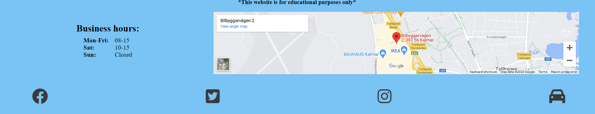
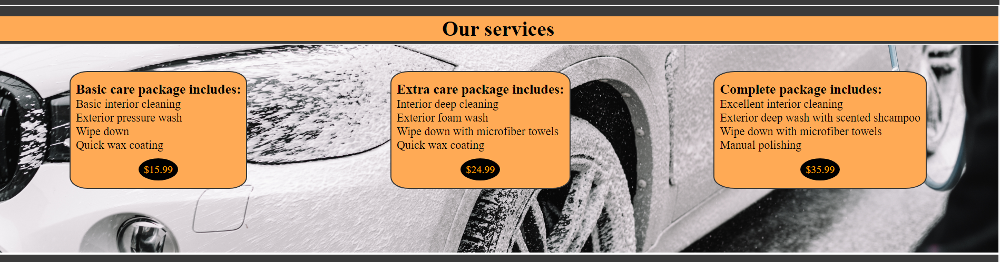
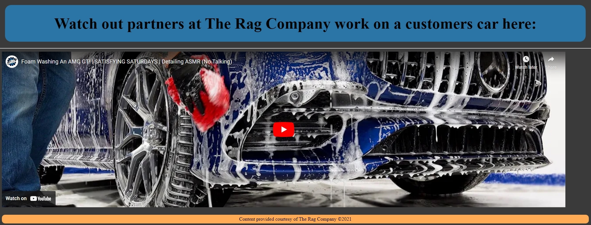
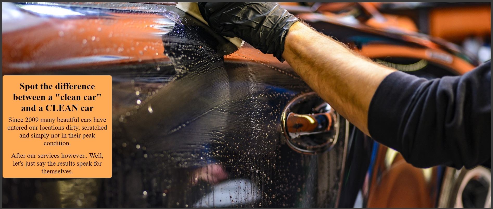
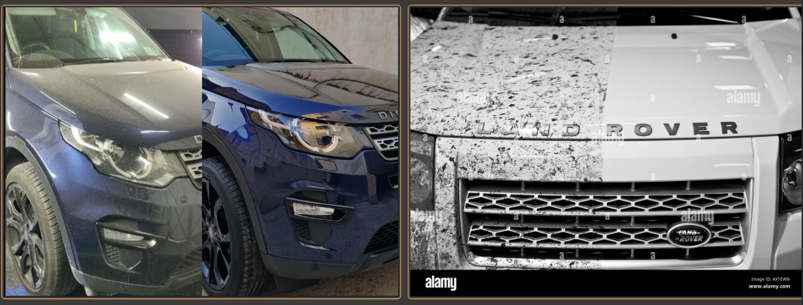
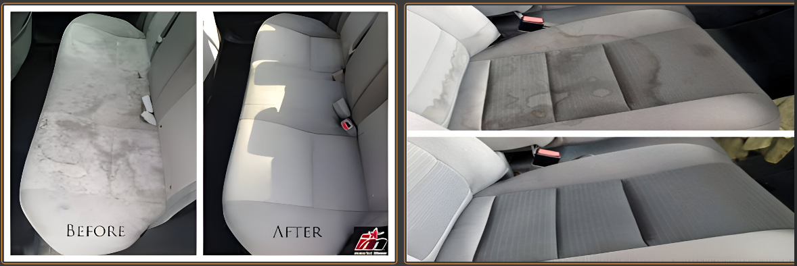
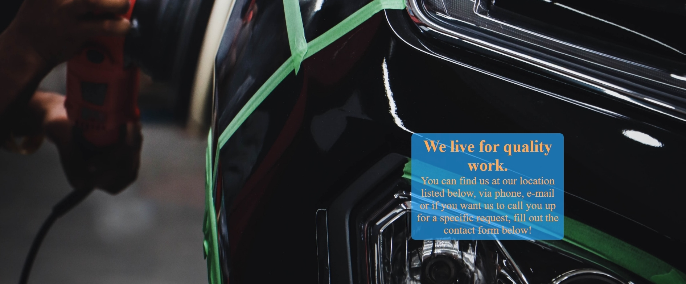

# Wash Your Car

Wash Your Car is a made up car detailing company located in Kalmar Sweden. Wash Your Car has different service packages for detailing cars, all varying in included service and all the info needed to contact or visit them. 

The purpose of this website is to give an online prescence for WashYourCar and to provide information to the customers about their prices, services and contact information. This website targets an audience of car enthusiasts in the market for detailing their car for photos, before a sale or as a way to showcase their passion for cars.

Visit the deployed website [here](https://justaduck98.github.io/washyourcar-companypage/).

## Table of Contents

- [Wash Your Car](#wash-your-car)
  - [Table of Contents](#table-of-contents)
  - [User Experience (UX)](#user-experience-ux)
    - [Project Goals](#project-goals)
    - [User Stories](#user-stories)
    - [Color Scheme](#color-scheme)
    - [Typography](#typography)
  - [Features](#features)
    - [General](#general)
    - [Landing Page](#landing-page)
    - [Previous work Page](#previous-work-page)
    - [Contact us Page](#contact-us-page)
  - [Technologies Used](#technologies-used)
    - [Languages Used](#languages-used)
    - [Frameworks, Libraries and Programs Used](#frameworks-libraries-and-programs-used)
  - [Testing](#testing)
    - [Testing User Stories](#testing-user-stories)
    - [Code Validation](#code-validation)
    - [Accessibility](#accessibility)
    - [Tools Testing](#tools-testing)
    - [Manual Testing](#manual-testing)
  - [Finished Product](#finished-product)
  - [Deployment](#deployment)
    - [GitHub Pages](#github-pages)
  - [Credits](#credits)
    - [Content](#content)
    - [Media](#media)
    - [Code](#code)
  - [Acknowledgements](#acknowledgements)

***

## User Experience (UX)

### Project Goals

* The website should have a clean and inspiring design, referencing the quality of the work done to appeal to the customers.

* Present the services offered and information about what they include in order to get more customers and be transparent about their prices.

* Provide the customer with useful information that allows them to contact or visit the business.

* Offer the option to send special requests, for example a taxi company wanting to hire them for cleaning all their cars.

### User Stories

* As a car enthusiast, I want a gallery of your previous work see how the work is being done.
* As a site visitor, I want information about your company and pictures of previous results so that I can be assured you do a good job.
* As a business owner, I want a contact form as well as contact information so that we can get in touch quickly without hassle.
* As a customer, I want to easily be able to find your services, price and a way to contact the the business via social media.
* As a customer, I want to easily find the business' location.

### Color Scheme

The colors used for this project are mainly blue(#209CEE), grey(#3a3a3a) and orange(#FA5). All the colours give a sense of trust, proffesionalism and excitement in that order. 

### Typography

The font used in the site is Kanit, with Sans Serif as the fallback font in case Kanit cannot be used for any reason. 

## Features

### General

* Responsive design across all device sizes and units, from mobile up to desktop.

* Similar color scheme and design throughout all pages to structure, categorise and present the information to the customers in a proffessional manner.

* **Header**

    
    - The header contains the business logo and fully responsive navigation bar positioned across the top of the screen.

    - The business logo functions as a link to the landing page.

    - The navigation bar looks the same on all pages, contains links to all pages to make it easy for customers to navigate across the site. It also has a hover effect that changes color to provide feedback to the customer for a better user experience.

    - The navigation links are combined into a burger-button menu based on Code Institutes "Love Running"-Walkthrough project, and allowed me to implement this feature and neat design without javascript.

* **Footer**

    - The footer includes an embedded map, opening hours and links to all the business' social media channels as well as a link to TheRagCompany's website, as a thank you to them for allowing me to use their video in my project.

### Landing Page

* **Main Image**

    - The main image was chosen to attract the customer's attention and represent the work of our business.

* **Our Services**

    - Contains a picture of a car being cleaned with text cards above it with information about the business.

* **Working Video Section**

    - Contains a header disclaiming the video was not made by WashYourCar as well as an embedded video.

### Previous work Page

* **Previous work landing section**

    -Displays an image of a car being cleaned by hand as well as a text card containing compelling text that peaks the customers interest to scroll further.
    
* **Previous work gallery section**
* 

    -Displays a responsive gallery before and after our work first exterior as seen above, then interior as seen below.

* 

### Contact us Page

* **Contact Landing Page**

    - This displays an image of a car being polished with a text card on top clarifying what content can be found on the page.
  
* **Contact Details**

    - The form allows the customer to find address to physical location, clickable phone number to call clickable email address to email as well as a special request form for other issues or if customers would prefer the company to call them up.

## Technologies Used

### Languages Used
* [HTML5](https://en.wikipedia.org/wiki/HTML5)
* [CSS3](https://en.wikipedia.org/wiki/CSS)

### Frameworks, Libraries and Programs Used

* [Google Fonts](https://fonts.google.com/)
    - Google Fonts was used to import the fonts Raleway, Cabin and Qahiri into the style.css file. These fonts were used throughout the site.

* [Font Awesome](https://fontawesome.com/)
     - Font Awesome was used for header and footer on all pages to add icons in order to create a better visual experience for UX purposes.

* [GitHub](https://github.com/)
     - GitHub was used to store the project after pushing.

* [Am I Responsive?](http://ami.responsivedesign.is/#)
    - Am I Responsive was used to generate mockup imagery.

* [Pixelcut](https://create.pixelcut.ai/upscaler)
  - Pixelcut was used for upscaling images to prevent them from being blurry, stretched and keep their original high-quality even if image element needed to be bigger than the original. 

* [Chrome DevTools](https://developer.chrome.com/docs/devtools/)
    - Chrome DevTools was used during development process for processing code and testing responsiveness.

* [W3C Markup Validator](https://validator.w3.org/)
    - W3C Markup Validator was used to validate the HTML code.

* [W3C CSS Validator](https://jigsaw.w3.org/css-validator/)
    - W3C CSS Validator was used to validate the CSS code.

## Testing

### Testing User Stories

* As a car enthusiast, I want a gallery of your previous work see how the work is being done.

     - The website offers previous work gallery of images from previous customers results.

    - An embedded video on the landing page shows the customers how the work is being done.

* As a customer, I want to be able to read more about the services available.

    - The services are all listed on the landing page, making it very easily accessable.

    - Each service text card contains useful information about the respective detailing package.

* As a business owner, I want a contact form as well as contact information so that we can get in touch quickly without hassle.

    - The contact us page found instantly in the navigation bar contains a clear contact section with all necessary business' contacts.
  
    - The contact us page also includes a contact form for special requests such as business proposals.

* As a customer, I want to easily be able to find your services, price and a way to contact the the business via social media.
    - The landing page showcases all the different services provided, what they include as well as their price on separate text cards. 

    - The footer provides link to the business' social media channels.

* As a customer, I want to easily find the business' location.

    - The footer on all pages contains an embedded Google map location of the business' geographical location.

    - The contact us page has the physical address written in plain text.

### Code Validation

* The [W3C Markup Validator](https://validator.w3.org/) and [W3C CSS Validator](https://jigsaw.w3.org/css-validator/) were used to validate all pages of the project in order to ensure there were no syntax errors.

    - W3C Markup Validator found an error concerning a previously used table structure used to display opening hours. To correct this the HTML was changed so that it was displayed using divs instead of a table.
     
    
    - Another error found by W3C Markup Validator was concerning a border value used inside the iframe tag to declare a border property around the video on the landing page. This was removed from index.html and moved to styles.css instead.

    -  W3C CSS Validator found no errors or warnings on my CSS.

### Accessibility

* Used Lighthouse in Chrome DevTools to confirm that the colors and fonts being used in throughout the website are easy to read and accessible.

* Lighthouse reports

    - **Landing Page**

    

    - **Previous Work Page**

    

    - **Contact Us Page**

    

### Tools Testing

* [Chrome DevTools](https://developer.chrome.com/docs/devtools/)

    - Chrome DevTools was used during the development process to test, explore and modify HTML elements and CSS styles used in the project.

* Responsiveness
    
    - [Am I Responsive?](http://ami.responsivedesign.is/#) was used to check responsiveness of the site pages across different devices.
    
    - Chrome DevTools was used to test responsiveness in different screen sizes during the development process.

### Manual Testing

* Browser Compatibility

    - The website has been tested on the following browsers:

        - **Goolgle Chrome**
        
        No appearance, responsiveness nor functionality issues.

        - **Mozilla Firefox**
                
        No responsiveness nor functionality issues.

        - **Microsoft Edge**
        
        No appearance, responsiveness nor functionality issues.

* Device compatibility

    - The website has been tested on these devices:

        - **Motorola G30**

        No appearance, responsiveness nor functionality issues.

        - **Windows 10 desktop**

        No appearance, responsiveness nor functionality issues.

* Elements Testing

    - All Pages
        
        - **Header**

            - Clicking on the main logo will bring the customer back to the landing page.

        - **Navigation Bar**

            - Hovering on the different navigation bar's links will trigger hover effect, highlighting the link for the customer.

            - Clicking on the navigation bar's links will bring the customer to the specified page.
        
        - **Footer**
        
            - Clicking on the social media links will open the specific website on a new tab.

            - Hovering the social media links will trigger hover effect highlighting icon for the customer.
  
            -  Clicking and dragging on the map in the find us section will move the area shown on the map. 

    - Previous Work Page

        - Images will scale based on device sized and present properly without being streched or warped.

    - Contact Us Page

        - When filling out the contact form, the customer is required to complete all fields as well as checking the checkbox before submitting.
        
        - Clicking the plus and minus buttons changes the zoom of the map.

## Deployment

* This website was developed using [CodeAnywhere](app.codeanywhere.com), which was then committed and pushed to GitHub using the provided terminal.

### GitHub Pages

* Here are the steps to deploy this website to GitHub Pages from its GitHub repository:

    1. Log in to GitHub and locate the [GitHub Repository](https://github.com/).

    2. At the top of the Repository, locate the Settings button on the menu.

    3. Scroll down the Settings page until you locate the Pages section.

    4. Under Source, click the dropdown called None and select Master Branch.

    5. The page will refresh automatically and generate a link to your website.

## Credits 

### Content

- All content was written by the developer.

### Media

- [Picjumbo](https://picjumbo.com/)
    
    - Main image <https://picjumbo.com/washing-white-suv-in-self-service-car-wash-with-a-wap-hose/>
    - Services background image https://picjumbo.com/active-foam-self-service-carwash/
    https://picjumbo.com/author/viktorhanacek/

* [Unsplash](https://unsplash.com/)

    - Contact Us Landing image: <https://unsplash.com/photos/rS9PBJBY5pc> by @neelabh_raj
    - Contact us form background image: <https://unsplash.com/photos/4mUNFO4Kjyk> by @ddography

- [Pixabay](https://pixabay.com/)

    -Previous Work Landing image: <https://pixabay.com/photos/cleaning-steam-smoke-pressure-1837331/> by DariuszSankowski

### Code

* [Stack Overflow](https://stackoverflow.com/) was consulted on a few occasions to be able to better understand the code and how to implement it correctly.

## Acknowledgements

* My tutor, Marcel, for his invaluable feedback and guidance.

* Code Institute and its amazing Slack community for their support and providing me with the necessary knowledge to complete this project.